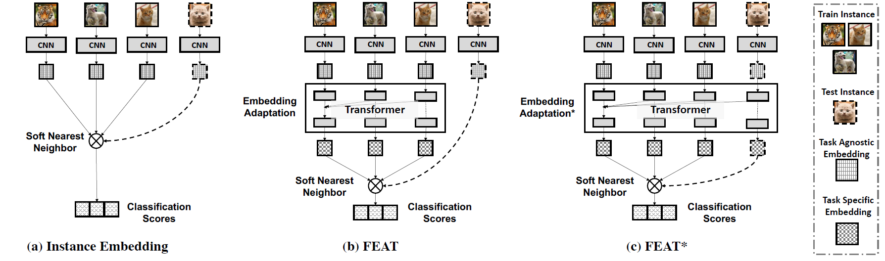

# Few-Shot Learning via Embedding Adaptation with Set-to-Set Functions

The code repository for "Few-Shot Learning via Embedding Adaptation with Set-to-Set Functions" [[paper]](https://openaccess.thecvf.com/content_CVPR_2020/papers/Ye_Few-Shot_Learning_via_Embedding_Adaptation_With_Set-to-Set_Functions_CVPR_2020_paper.pdf) [[ArXiv]](https://arxiv.org/abs/1812.03664) [[slides]](https://drive.google.com/file/d/17LpnSuT-fy-Je7hWxHV7o61jVFDQf3TK/view?usp=sharing) [[poster]](https://drive.google.com/file/d/1R4_eoxI9VrfUMzgcoBG9veJG2fhhQzxi/view?usp=sharing) (Accepted by CVPR 2020) in PyTorch. If you use any content of this repo for your work, please cite the following bib entry:

    @inproceedings{ye2020fewshot,
      author    = {Han-Jia Ye and
                   Hexiang Hu and
                   De-Chuan Zhan and
                   Fei Sha},
      title     = {Few-Shot Learning via Embedding Adaptation with Set-to-Set Functions},
      booktitle = {IEEE/CVF Conference on Computer Vision and Pattern Recognition (CVPR)},
      pages     = {8808--8817},
      year      = {2020}
    }

## Embedding Adaptation with Set-to-Set Functions

We propose a novel model-based approach to adapt the instance embeddings to the target classification task with a #set-to-set# function, yielding embeddings that are task-specific and are discriminative. We empirically investigated various instantiations of such set-to-set functions and observed the Transformer is most effective --- as it naturally satisfies key properties of our desired model. We denote our method as Few-shot Embedding Adaptation with Transformer (FEAT).

## Standard Few-shot Learning Results

Experimental results on few-shot learning datasets with ResNet-12 backbone (Same as [this repo](https://github.com/kjunelee/MetaOptNet)). We report average results with 10,000 randomly sampled few-shot learning episodes for stablized evaluation.

**MiniImageNet Dataset**
|  Setups  | 1-Shot 5-Way | 5-Shot 5-Way |   [Link to Weights](https://drive.google.com/drive/folders/1PgjybQHxjP65MvcI4C1vnMCPsvsoaAFJ?usp=sharing) |
|:--------:|:------------:|:------------:|:-----------------:|
| ProtoNet |     62.39    |     80.53    | [1-Shot](https://drive.google.com/file/d/1zfG8C9ZgZfSgmxtxZiaC0ahOomTXtvBq/view?usp=sharing),   [5-Shot](https://drive.google.com/file/d/1NVMwb417dneI8YCjFakbA1VeGtyWCpCO/view?usp=sharing) |
|  BILSTM  |     63.90    |     80.63    | [1-Shot](https://drive.google.com/file/d/1t_W-EY1dgeWdGab5sqOPbGcxGqegxrIG/view?usp=sharing),   [5-Shot](https://drive.google.com/file/d/1ZnqRNtnIzXkq4kZTvHxo_mfAggUm4lSb/view?usp=sharing)|
| DEEPSETS |     64.14    |     80.93    | [1-Shot](https://drive.google.com/file/d/1l2mSVMwrgQYR9hHo1-9AZATp16PcqcXx/view?usp=sharing),   [5-Shot](https://drive.google.com/file/d/179NnaVbx8nNlw8Op4hzBhLz2mjX4iIhz/view?usp=sharing)|
|    GCN   |     64.50    |     81.65    | [1-Shot](https://drive.google.com/file/d/13ITR3aF5XAzvDIsLa-Qzzf7zuNoy8W2_/view?usp=sharing),   [5-Shot](https://drive.google.com/file/d/1T2us_VCl3MBKwf-6M4FoCJjda7T8-umV/view?usp=sharing)|
|   FEAT   |   **66.78**  |   **82.05**  | [1-Shot](https://drive.google.com/file/d/1ixqw1l9XVxl3lh1m5VXkctw6JssahGbQ/view?usp=sharing),   [5-Shot](https://drive.google.com/file/d/1tCU52WiK6JBydnALI_gF9nYiFCNvvT1A/view?usp=sharing)|

**TieredImageNet Dataset**

|  Setups  | 1-Shot 5-Way | 5-Shot 5-Way |   [Link to Weights](https://drive.google.com/drive/folders/1L15ddQJysiZEVTEMYy7do2_XblGIViyy?usp=sharing) |
|:--------:|:------------:|:------------:|:-----------------:|
| ProtoNet |     68.23    |     84.03    | [1-Shot](https://drive.google.com/file/d/19pF7IBkxukOaC-m1CKxq_bc5Sq1Idk_R/view?usp=sharing),   [5-Shot](https://drive.google.com/file/d/1YjSl2TBEAb7ZE0SeyjwwoM0G5cP70GoA/view?usp=sharing) |
|  BILSTM  |     68.14    |     84.23    | [1-Shot](https://drive.google.com/file/d/1_fP2E0e_JsXP7EYAY-jFHpev1y-VMxTb/view?usp=sharing),   [5-Shot](https://drive.google.com/file/d/1wBi2QKMxGVVdWpxAIpUxpOfCs3hNDcnP/view?usp=sharing) |
| DEEPSETS |     68.59    |     84.36    | [1-Shot](https://drive.google.com/file/d/1Uuv5zeqHpwq2Prk70CpkPtsaI49z2t7y/view?usp=sharing),   [5-Shot](https://drive.google.com/file/d/1vtV83CjnH2I61bpuEga1kvf0ZiXD7Q23/view?usp=sharing) |
|    GCN   |     68.20    |     84.64    | [1-Shot](https://drive.google.com/file/d/1j_QLHAL7RFZRplKjl7XC_Ma9kl4GOySv/view?usp=sharing),   [5-Shot](https://drive.google.com/file/d/1diY1IIO8u12EsDBkeueh8eQGBBh5CjVW/view?usp=sharing) |
|   FEAT   |   **70.80**  |   **84.79**  | [1-Shot](https://drive.google.com/file/d/1M93jdOjAn8IihICPKJg8Mb4B-eYDSZfE/view?usp=sharing),   [5-Shot](https://drive.google.com/file/d/1nM4HGGZmMpC57cpe7cqY3WdpL8WlyRay/view?usp=sharing) |

## Prerequisites

The following packages are required to run the scripts:

- [PyTorch-1.4 and torchvision](https://pytorch.org)

- Package [tensorboardX](https://github.com/lanpa/tensorboardX)

- Dataset: please download the dataset and put images into the folder data/[name of the dataset, miniimagenet or cub]/images

- Pre-trained weights: please download the [pre-trained weights](https://drive.google.com/open?id=14Jn1t9JxH-CxjfWy4JmVpCxkC9cDqqfE) of the encoder if needed. The pre-trained weights can be downloaded in a [zip file](https://drive.google.com/file/d/1XcUZMNTQ-79_2AkNG3E04zh6bDYnPAMY/view?usp=sharing).

## Dataset

### MiniImageNet Dataset

The MiniImageNet dataset is a subset of the ImageNet that includes a total number of 100 classes and 600 examples per class. We follow the [previous setup](https://github.com/twitter/meta-learning-lstm), and use 64 classes as SEEN categories, 16 and 20 as two sets of UNSEEN categories for model validation and evaluation, respectively.

### CUB Dataset
[Caltech-UCSD Birds (CUB) 200-2011 dataset](http://www.vision.caltech.edu/visipedia/CUB-200-2011.html) is initially designed for fine-grained classification. It contains in total 11,788 images of birds over 200 species. On CUB, we randomly sampled 100 species as SEEN classes, and another two 50 species are used as two UNSEEN sets. We crop all images with given bounding boxes before training. We only test CUB with the ConvNet backbone in our work.

### TieredImageNet Dataset
[TieredImageNet](https://github.com/renmengye/few-shot-ssl-public) is a large-scale dataset  with more categories, which contains 351, 97, and 160 categoriesfor model training, validation, and evaluation, respectively. The dataset can also be download from [here](https://github.com/kjunelee/MetaOptNet).
We only test TieredImageNet with ResNet backbone in our work.

Check [this](https://github.com/Sha-Lab/FEAT/blob/master/data/README.md) for details of data downloading and preprocessing.

## Code Structures
To reproduce our experiments with FEAT, please use **train_fsl.py**. There are four parts in the code.
 - `model`: It contains the main files of the code, including the few-shot learning trainer, the dataloader, the network architectures, and baseline and comparison models.
 - `data`: Images and splits for the data sets.
 - `saves`: The pre-trained weights of different networks.
 - `checkpoints`: To save the trained models.

## Model Training and Evaluation
Please use **train_fsl.py** and follow the instructions below. FEAT meta-learns the embedding adaptation process such that all the training instance embeddings in a task is adapted, based on their contextual task information, using Transformer. The file will automatically evaluate the model on the meta-test set with 10,000 tasks after given epochs.

## Arguments
The train_fsl.py takes the following command line options (details are in the `model/utils.py`):

**Task Related Arguments**
- `dataset`: Option for the dataset (`MiniImageNet`, `TieredImageNet`, or `CUB`), default to `MiniImageNet`

- `way`: The number of classes in a few-shot task during meta-training, default to `5`

- `eval_way`: The number of classes in a few-shot task during meta-test, default to `5`

- `shot`: Number of instances in each class in a few-shot task during meta-training, default to `1`

- `eval_shot`: Number of instances in each class in a few-shot task during meta-test, default to `1`

- `query`: Number of instances in each class to evaluate the performance during meta-training, default to `15`

- `eval_query`: Number of instances in each class to evaluate the performance during meta-test, default to `15`

**Optimization Related Arguments**
- `max_epoch`: The maximum number of training epochs, default to `200`

- `episodes_per_epoch`: The number of tasks sampled in each epoch, default to `100`

- `num_eval_episodes`: The number of tasks sampled from the meta-val set to evaluate the performance of the model (note that we fix sampling 10,000 tasks from the meta-test set during final evaluation), default to `200`

- `lr`: Learning rate for the model, default to `0.0001` with pre-trained weights

- `lr_mul`: This is specially designed for set-to-set functions like FEAT. The learning rate for the top layer will be multiplied by this value (usually with faster learning rate). Default to `10`

- `lr_scheduler`: The scheduler to set the learning rate (`step`, `multistep`, or `cosine`), default to `step`

- `step_size`: The step scheduler to decrease the learning rate. Set it to a single value if choose the `step` scheduler and provide multiple values when choosing the `multistep` scheduler. Default to `20`

- `gamma`: Learning rate ratio for `step` or `multistep` scheduler, default to `0.2`

- `fix_BN`: Set the encoder to the evaluation mode during the meta-training. This parameter is useful when meta-learning with the WRN. Default to `False`

- `augment`: Whether to do data augmentation or not during meta-training, default to `False`

- `mom`: The momentum value for the SGD optimizer, default to `0.9`

- `weight_decay`: The weight_decay value for SGD optimizer, default to `0.0005`

**Model Related Arguments**
- `model_class`: The model to use during meta-learning. We provide implementations for baselines (`MatchNet` and `ProtoNet`), set-to-set functions (`BILSTM`, `DeepSet`, `GCN`, and our `FEAT` variants). We also include an instance-specific embedding adaptation approach `FEAT`, which is discussed in the old version of the paper. `SemiFEAT` is the one which combines the unlabeled query set instances into the feature adaptation in a transductive manner, while `SemiProtoFEAT` applies Semi-ProtoNet over the transductively transformed embeddings of `SemiFEAT`. Default to `FEAT`

- `use_euclidean`: Use the euclidean distance or the cosine similarity to compute pairwise distances. We use the euclidean distance in the paper. Default to `False`

- `backbone_class`: Types of the encoder, i.e., the convolution network (`ConvNet`), ResNet-12 (`Res12`), or Wide ResNet (`WRN`), default to `ConvNet`

- `balance`: This is the balance weight for the contrastive regularizer. Default to `0`

- `temperature`: Temperature over the logits, we #divide# logits with this value. It is useful when meta-learning with pre-trained weights. Default to `1`

- `temperature2`: Temperature over the logits in the regularizer, we divide logits with this value. This is specially designed for the contrastive regularizer. Default to `1`

**Other Arguments** 
- `orig_imsize`: Whether to resize the images before loading the data into the memory. `-1` means we do not resize the images and do not read all images into the memory. Default to `-1`

- `multi_gpu`: Whether to use multiple gpus during meta-training, default to `False`

- `gpu`: The index of GPU to use. Please provide multiple indexes if choose `multi_gpu`. Default to `0`

- `log_interval`: How often to log the meta-training information, default to every `50` tasks

- `eval_interval`: How often to validate the model over the meta-val set, default to every `1` epoch

- `save_dir`: The path to save the learned models, default to `./checkpoints`

Running the command without arguments will train the models with the default hyper-parameter values. Loss changes will be recorded as a tensorboard file.

## Training scripts for FEAT

For example, to train the 1-shot/5-shot 5-way FEAT model with ConvNet backbone on MiniImageNet:

    $ python train_fsl.py  --max_epoch 200 --model_class FEAT --use_euclidean --backbone_class ConvNet --dataset MiniImageNet --way 5 --eval_way 5 --shot 1 --eval_shot 1 --query 15 --eval_query 15 --balance 1 --temperature 64 --temperature2 16 --lr 0.0001 --lr_mul 10 --lr_scheduler step --step_size 20 --gamma 0.5 --gpu 8 --init_weights ./saves/initialization/miniimagenet/con-pre.pth --eval_interval 1
    $ python train_fsl.py  --max_epoch 200 --model_class FEAT --use_euclidean --backbone_class ConvNet --dataset MiniImageNet --way 5 --eval_way 5 --shot 5 --eval_shot 5 --query 15 --eval_query 15 --balance 0.1 --temperature 32 --temperature2 64 --lr 0.0001 --lr_mul 10 --lr_scheduler step --step_size 20 --gamma 0.5 --gpu 14 --init_weights ./saves/initialization/miniimagenet/con-pre.pth --eval_interval 1

to train the 1-shot/5-shot 5-way FEAT model with ResNet-12 backbone on MiniImageNet:

    $ python train_fsl.py  --max_epoch 200 --model_class FEAT  --backbone_class Res12 --dataset MiniImageNet --way 5 --eval_way 5 --shot 1 --eval_shot 1 --query 15 --eval_query 15 --balance 0.01 --temperature 64 --temperature2 64 --lr 0.0002 --lr_mul 10 --lr_scheduler step --step_size 40 --gamma 0.5 --gpu 1 --init_weights ./saves/initialization/miniimagenet/Res12-pre.pth --eval_interval 1 --use_euclidean
    $ python train_fsl.py  --max_epoch 200 --model_class FEAT  --backbone_class Res12 --dataset MiniImageNet --way 5 --eval_way 5 --shot 5 --eval_shot 5 --query 15 --eval_query 15 --balance 0.1 --temperature 64 --temperature2 32 --lr 0.0002 --lr_mul 10 --lr_scheduler step --step_size 40 --gamma 0.5 --gpu 0 --init_weights ./saves/initialization/miniimagenet/Res12-pre.pth --eval_interval 1 --use_euclidean

to train the 1-shot/5-shot 5-way FEAT model with ResNet-12 backbone on TieredImageNet:

    $ python train_fsl.py  --max_epoch 200 --model_class FEAT  --backbone_class Res12 --dataset TieredImageNet --way 5 --eval_way 5 --shot 1 --eval_shot 1 --query 15 --eval_query 15 --balance 0.1 --temperature 64 --temperature2 64 --lr 0.0002 --lr_mul 10 --lr_scheduler step --step_size 20 --gamma 0.5 --gpu 0 --init_weights ./saves/initialization/tieredimagenet/Res12-pre.pth --eval_interval 1  --use_euclidean
    $ python train_fsl.py  --max_epoch 200 --model_class FEAT  --backbone_class Res12 --dataset TieredImageNet --way 5 --eval_way 5 --shot 5 --eval_shot 5 --query 15 --eval_query 15 --balance 0.1 --temperature 32 --temperature2 64 --lr 0.0002 --lr_mul 10 --lr_scheduler step --step_size 40 --gamma 0.5 --gpu 0 --init_weights ./saves/initialization/tieredimagenet/Res12-pre.pth --eval_interval 1  --use_euclidean

## Acknowledgment
We thank the following repos providing helpful components/functions in our work.
- [ProtoNet](https://github.com/cyvius96/prototypical-network-pytorch)

- [MatchingNet](https://github.com/gitabcworld/MatchingNetworks)

- [PFA](https://github.com/joe-siyuan-qiao/FewShot-CVPR/)

- [Transformer](https://github.com/jadore801120/attention-is-all-you-need-pytorch)

- [MetaOptNet](https://github.com/kjunelee/MetaOptNet/)

