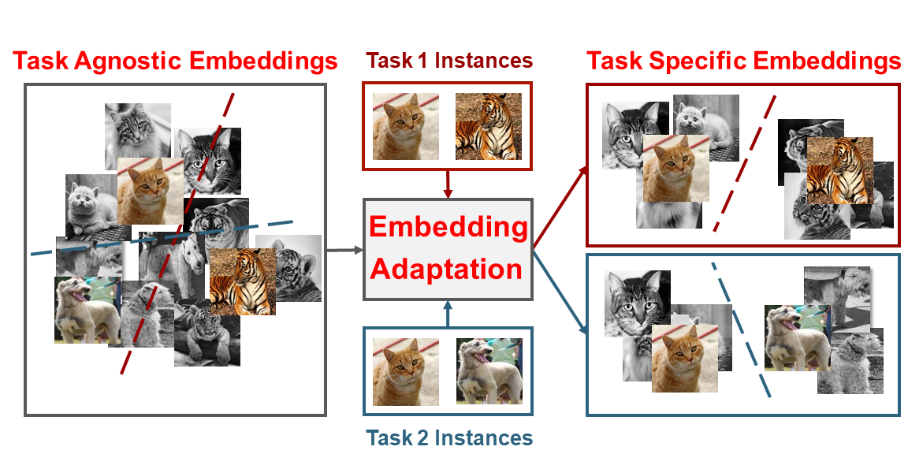

# FEAT
The code repository for "[Learning Embedding Adaptation for Few-Shot Learning](https://arxiv.org/abs/1812.03664)" in PyTorch

## Few-Shot Learning via Transformer

Few-shot learning methods address this challenge by learning an instance embedding function from seen classes, and apply the function to instances from unseen classes with limited labels. This style of transfer learning is task-agnostic: the embedding function is not learned optimally discriminative with respect to the unseen classes, where discerning among them is the target task. In this work, we propose a novel approach to adapt the embedding model to the target classification task, yielding embeddings that are task-specific and are discriminative. To this end, we employ a type of self-attention mechanism called Transformer to transform the embeddings from task-agnostic to task-specific by focusing on relating instances from the test instances to the training instances in both seen and unseen classes.

### Prerequisites

The following packages are required to run the scripts:

- [PyTorch-0.4 and torchvision](https://pytorch.org)

- Package [tensorboardX](https://github.com/lanpa/tensorboardX)

- Dataset: please download dataset and put images into the folder data/[name of dataset, miniimagenet or cub]/images

- Pre-trained weights: please download the [pre-trained weights](https://hkxloux03-my.sharepoint.com/:f:/g/personal/yehj_suko_email/EjSJu5jtyqZKn6cGbXyZ2J0BKYfbYZ_mxArs7dZz1d9ACQ?e=nd0QWQ) of the encoder if needed

### Dataset
 
#### MiniImageNet Dataset

The MiniImageNet dataset is a subset of the ImageNet that includes a total number of 100 classes and 600 examples per class. We follow the [previous setup](https://github.com/twitter/meta-learning-lstm), and use 64 classes as SEEN categories, 16 and 20 as two sets of UNSEEN categories for model validation and evaluation respectively.

#### CUB Dataset
[Caltech-UCSD Birds (CUB) 200-2011 dataset](http://www.vision.caltech.edu/visipedia/CUB-200-2011.html) is initially designed for fine-grained classification. It contains in total 11,788 images of birds over 200 species. On CUB, we randomly sampled 100 species as SEEN classes, another two 50 species are used as two UNSEEN sets. We crop all images with given bounding box before training. We only test CUB with ConvNet backbone in our work.

### Model Training

#### Baseline Methods
We implement two baseline approaches in this repo, i.e., the [Matching Network](https://arxiv.org/abs/1606.04080) and [Prototypical Network](https://arxiv.org/abs/1703.05175). To train the them on this task, cd into this repo's root folder and execute:

    $ python train_matchnet.py (or python train_protonet.py)

The train_matchnet.py takes the following command line options:

- `max_epoch`: The maximum number of training epochs, default to `200`

- `way`: The number of classes in a few-shot task, default to `5`

- `shot`: Number of instances in each class in a few-shot task, default to `1`

- `query`: Number of instances in each class to evaluate the performance in both meta-training and meta-test stages, default to `15`

- `lr`: Learning rate for the model, default to `0.0001` with pre-trained model

- `step_size`: StepLR learning rate scheduler step, default to `20`

- `gamma`: StepLR learning rate ratio, default to `0.2`

- `temperature`: Temperature over the logits, we divide logits with this value, default to `1`

- `model_type`: Two types of encoder, i.e., the convolution network and ResNet, default to `ConvNet`

- `dataset`: Option for the dataset (MiniImageNet or CUB), default to `MiniImageNet`

- `init_weights`: The path to the initial weights, default to `None`

- `gpu`: The index of GPU to use, default to `0`

- `use_bilstm`: This is specially designed for Matching Network. If this is true, bi-LSTM is used for embedding adaptation. Default to `False`

- `lr_mul`: This is specially designed for Matching Network with bi-LSTM and FEAT. The learning rate for the top layer will be multiplied by this value (usually with faster learning rate). Default to `10`

Running the command without arguments will train the models with the default hyperparamters values. Loss changes will be recorded as a tensorboard file in the ./runs folder.

#### FEAT Approach
For FEAT, the embedding of all instances in a task is adapted based on the Transformer. The learned model on MiniImageNet and CUB can be found [in this link]().

- `balance`: This is the weights for the FEAT regularizer. Default to `10`

    $ python train_feat.py

## .bib citation
If this repo helps in your work, please cite the following paper:

    @article{DBLP:YeHZS2018Learning,
      author    = {Han-Jia Ye and
                   Hexiang Hu and
                   De-Chuan Zhan and
                   Fei Sha},
      title     = {Learning Embedding Adaptation for Few-Shot Learning},
      journal   = {CoRR},
      volume    = {abs/1812.03664},
      year      = {2018}
    }

## Acknowledgment
We thank following repos providing helpful components/functions in our work.
- [ProtoNet](https://github.com/cyvius96/prototypical-network-pytorch)

- [MatchingNet](https://github.com/gitabcworld/MatchingNetworks)

- [PFA](https://github.com/joe-siyuan-qiao/FewShot-CVPR/)

- [Transformer](https://github.com/jadore801120/attention-is-all-you-need-pytorch)
